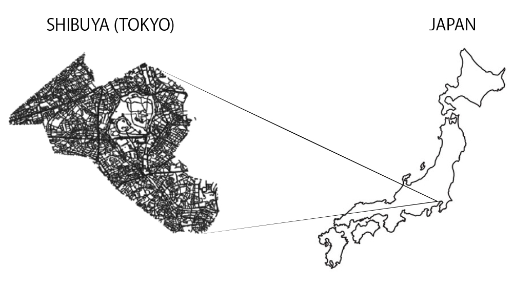
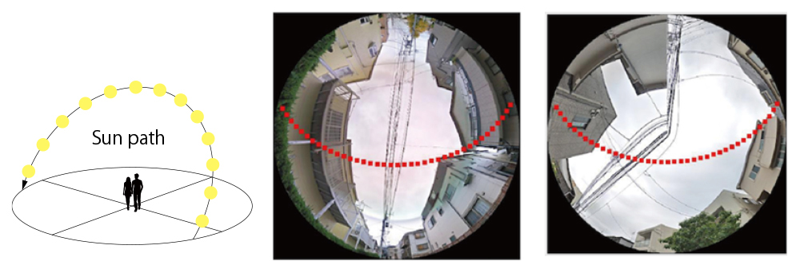
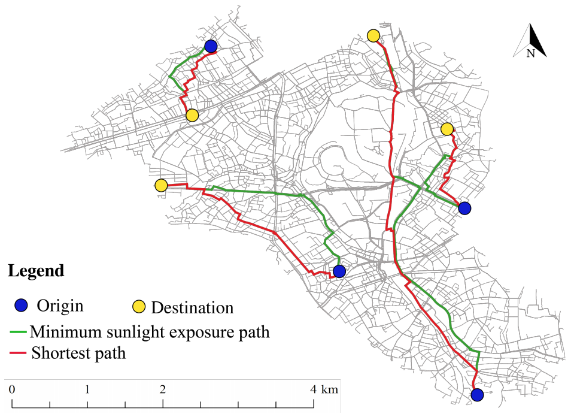

## HIKAGE FINDER
Summer in Tokyo is incredibly hot!
The temperature can reach around 40℃ with high humidity. The hot summer environment significantly decreases people’s motivation to walk outdoors, resulting in reduced quality of life – they can’t fully enjoy what the city has to offer them. To address this problem, we created an app that looks for shaded paths in Tokyo’s Shibuya district. HIKAGE FINDER helps you explore the city in comfort by identifying the coolest paths, rather than the shortest ones. It avoids areas of direct sunlight, meaning you can walk more comfortably on those hot summer days. This is how HIKAGE FINDER can enhance your enjoyment of life in the city.

[Project Site](https://urbansciences.jp/en/1112/)

## TECHNICAL DESCRIPTION

1. Google Street Views along with the street network

We collected Google Street View images and obtained a street network from Open Street Map. We set a collecting point every 10 meters along the street network, covering the Shibuya district. The collected Google Street View panoramas resulted in 45,085 photos.



2. Geometrical transformation from GSV to Hemispherical image

We used PSPNet, an image segmentation algorithm, to segment GSV panoramas into sky pixels and obstruction pixels. This allowed us to calculate the dimension of the area exposed to sunlight. The segmented GSV panoramas were then transformed into a hemispherical image.


3. Human exposure to sunlight in street canyon



The above figure shows a geometrical model of the sun and an overlay of the sun’s path in one day on hemispherical images. This model enables us to estimate the volume and location of sunlight depending on the time and day of the year.

4. Results: the spatial distributions of street-level sunlight exposure


The above image shows the results of the shortest path and the minimum sunlight exposure path. Through the random selection process, our result indicates that HIKAGE route decreases 35.23% of the potential sunlight exposure when it takes the shortest path.



HIKAGE FINDER enables us to explore the most suitable routes, considering the volumes of solar radiation.


## OPEN STRATEGY

We publish all codes in Github to make your own HIKAGE FINDER for your city. This enables you to collect the relevant datasets and create the algorithm for setting up the app.


### HOW TO RUN THE CODE
Note that we only support Python 3 (up to 3.7).

0. Clone and install dependencies
- Create a virtual environment and activate it.
```
python3 -m venv ~/.shadefinder
source ~/.shadefinder/bin/activate
```
- Install dependencies.
```

# required for Fiona
brew install gdal 
pip3 install GDAL==$(gdal-config --version | awk -F'[.]' '{print $1"."$2}')

# required for rtree
brew install spatialindex

# install dependency of PyMeanShift
pip3 install numpy==1.18.3

# download PyMeanShift (not available on PIP) and install
git clone https://github.com/fjean/pymeanshift.git
cd pymeanshift
sudo python setup.py install
cd ../

# clone Treepedia repository and install remaining dependencies using pip
git clone https://github.com/xiaojianggis/shadefinder.git
cd shadefinder
pip3 install -r requirements.txt
```

Please refer to [apps/pipline.py](apps/pipline.py) in the repository, for an end-to-end flow of the pipeline.

1. Google Street View data preparation

2. Meatadata collection, cleanning, and organizing

3. GSV images processing
- Collect the street-level images
- Image projections
- Image segmentation
- Object segmentation

4. Shade finding
- Create DSM/DEM from LiDAR cloud point
- Using Solweig model to estimate the mean radiant temperature


## PUBLICATION

Li, X., Yoshimura, Y., Tu, W., Ratti, C. (2020). A pedestrian level strategy to minimize outdoor sunlight exposure in hot summer, arXiv.

This work is the collaboration: Urban Sciences Lab at The University of Tokyo and Xiaojiang Li at Temple University.

