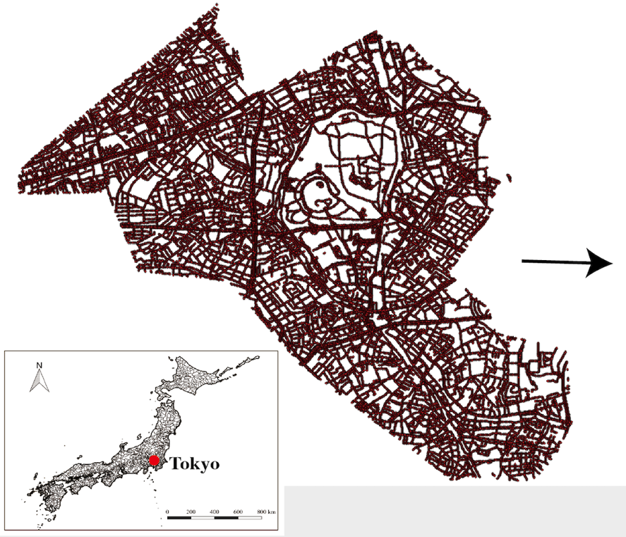
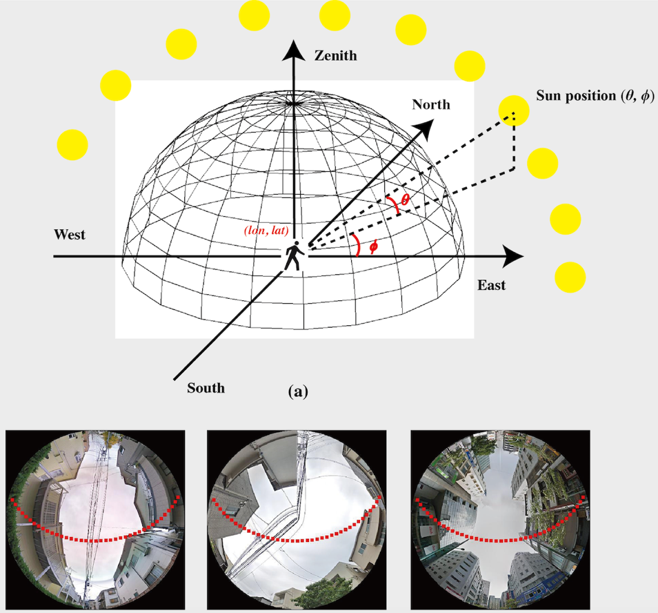
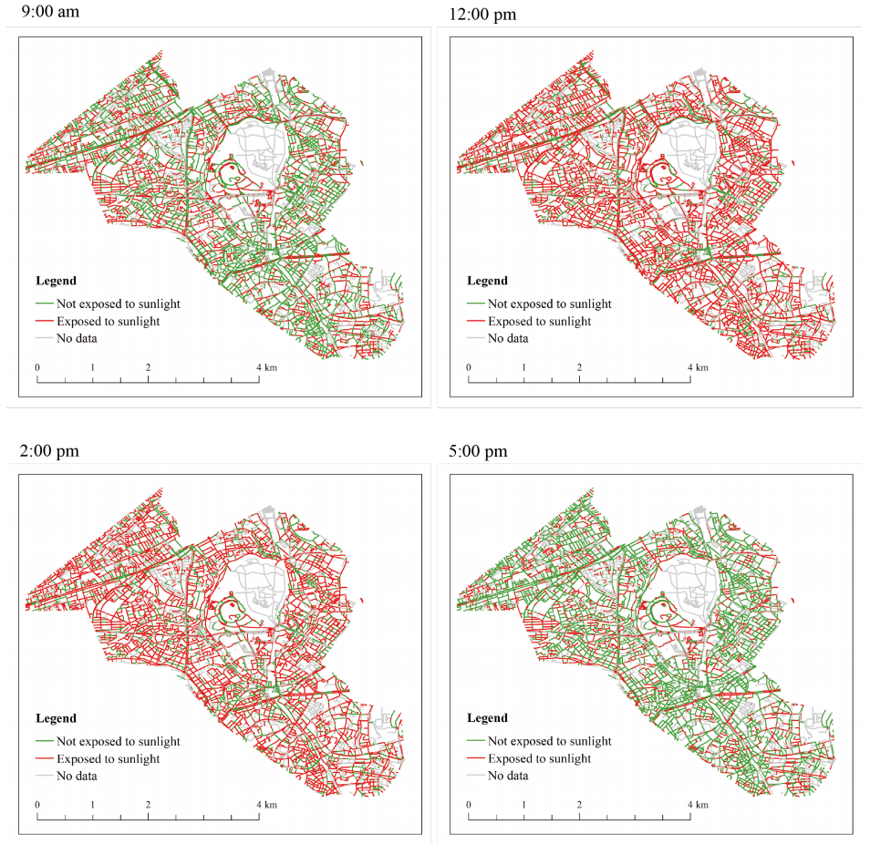
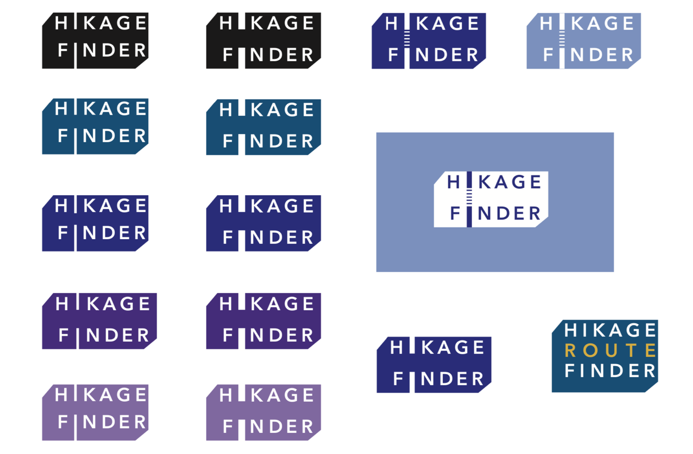
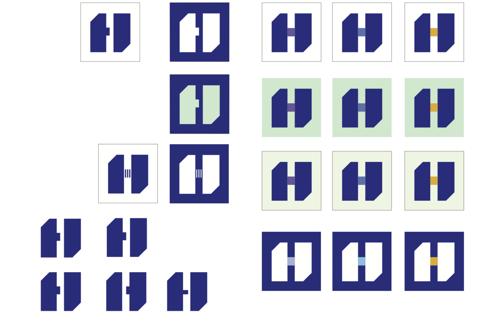
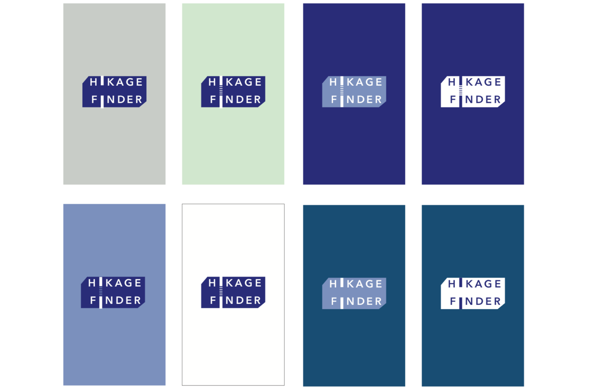
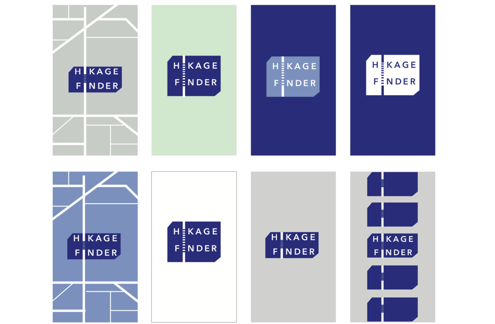

## StreetSensing: Using street-level images to understand urban environment

Using Street-level images and computer vision to understand the urban streetscape environment.

Applications: 

1. Google Street View data preparation

2. Meatadata collection, cleanning, and organizing

3. GSV images processing
- Collect the street-level images
- Image projections
- Image segmentation
- Object segmentation

4. Shade finding
- Create DSM/DEM from LiDAR cloud point
- Using Solweig model to estimate the mean radiant temperature

## HIKAGE FINDER
The summer in Tokyo is very hot! The temperature is going up around 40 degree with the high humidity. The hot summer environment significantly decreases people’s motivation to walk in the streets, resulting in reducing their quality of life. For this problem, we created the app to look for the shadow path in Shibuya district, Tokyo. HIKAGE FINDER helps you to explore the low temperature path instead of the shortest path in the city. It avoids to be directly shined, consequently, you can walk more comfortable in the hot summer day. In this way, HIKAGE FINDER can enhance people’s quantify of life in the city.

## TECHNICAL DESCRIPTION

1. Google Street Views along with the street network
We collected the google street view images along with the street network obtained from Open Street Map. We set the collecting point as each 20 meter along with the street network. This results in 30,000 points over Shibuya district and the number of collected Google street view panorama is 30,000 photos.

2. Geometrical transformation from GSV to Hemispherical image
We used PSPNet, which is the image segmentation algorithm, for segmenting GSV panoramas into sky pixels and obstruction pixels. This allows us to calculate the area dimension, which the sunlight can be poured down. Then, the segmented GSV panoramas are transformed into the hemispherical image.

3. Human exposure to sunlight in street canyon
The above figure shows the geometrical model of the sun and the overlay of sun path in one day on hemispherical images. This model enables us to estimate the volume of the sunlight and sun light’s locations depending on the time and day of the year.

4. Results: the spatial distributions of street-level sunlight exposure

The above image shows the results of the shortest path and the minimum sunlight exposure path. Through the random selection process, our result indicates that HIKAGE route decreases 35.23% of the potential sunlight exposure when it takes the shortest path.

## OPEN STRATEGY

We publish all codes in Github to make your own HIKAGE FINDER for your city. This enables you to collect the relevant datasets and create the algorithm for setting up the app.

## DESIGN STRATEGY

The logo of HIKAGE FINDER is designed by Minako Izumi.

## PUBLICATION

Li, X., Yoshimura, Y., Tu, W., Ratti, C. (2020). A pedestrian level strategy to minimize outdoor sunlight exposure in hot summer, arXiv.

This work is the collaboration: Urban Sciences Lab at The University of Tokyo and Xiaojiang Li at Temple University.
